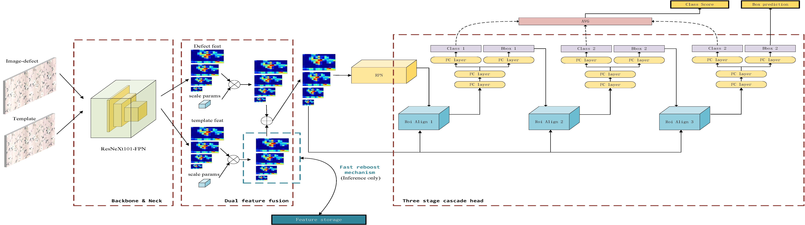

### Introduction

本代码为天池广东工业智能大赛布匹瑕疵检测第二名方案, code base为mmdetection.

项目由@cizhenshi  @Okersira 共同合作完成.

### Code Structure

本次提交代码目录如下：

|-project

&emsp;|-data (数据目录)

&emsp;&emsp;|-round2_data（PrepareData.sh生成）

&emsp;&emsp;&emsp;|-Annotations

&emsp;&emsp;&emsp;|-normal

&emsp;&emsp;&emsp;|-defect

&emsp;|-submit (结果文件生成目录)

&emsp;|-src（关键源代码）

&emsp;&emsp;|-train_model1.sh（训练第一个模型）

&emsp;&emsp;|-train_model2.sh（训练第二个模型）

&emsp;&emsp;|-run.sh（前向运行脚本，运行后将输出结果文件到submit目录下）

&emsp;|-PrepareData.sh（数据准备脚本，运行后将生成训练所需文件）

&emsp;|-config（模型定义文件）

&emsp;|-weights（前向所需的模型权重）

### Requirements

代码基于Pytorch 下的mmdetection, 依赖以下库

- Linux (Windows is not officially supported)
- Python 3.6.8 
- PyTorch 1.1
- NCCL 2
- GCC(G++) 4.9 or higher
- [mmcv](https://github.com/open-mmlab/mmcv)
- Cython
- tqdm
- icecream
- OS: Ubuntu 16.04
- CUDA: 9.0
- NCCL: 2.1.15/2.2.13/2.3.7/2.4.2
- GCC(G++): 4.9/5.3/5.4/7.3

### Install

进入src目录，执行以下操作

a. Create a conda virtual environment and activate it.

```
conda create -n open-mmlab python=3.7 -y
conda activate open-mmlab
```

b. Install PyTorch stable or nightly and torchvision following the [official instructions](https://pytorch.org/), e.g.,

```
pip install torch==1.1.0 tochvision==0.3.0
pip install tqdm
pip install icecream
pip install cython
pip install mmcv
pip install -r requirement.txt
```

本地使用pytorch1.1版本训练，请确保pytorch 版本为1.1

c. Install code(other dependencies will be installed automatically).

```
python setup.py develop
```

因机器不同可能有其他依赖，如遇运行失败、卡顿网速慢等情况可根据运行情况手动安装需要的包

### Prepare Data

1.确保数据集数据结构如下所示：

|–data
 	|–guangdong1_round2_train_part1_20190924
	|–guangdong1_round2_train_part2_20190924
 	|–guangdong1_round2_train_part3_20190924
	|–guangdong1_round2_train2_20191004_images
 	|–guangdong1_round2_train2_20191004_Annotations

2.解压原始数据，原始数据将会解压到data 目录下

unzip '*.zip'

3.将训练数据和测试数据转化为COCO格式

在project目录下执行sh PrepareData.sh 将会在data目录下生成所需的训练文件和coco格式的标注

### Train

cd ./src

-训练第一个模型（第一个模型为ResNet101+DCN)

sh train_model1.sh GPU_NUM

-训练第二个模型(第二个模型为ResNext101+DCN)

sh train_model2.sh GPU_NUM

默认配置文件中GPU_NUM应该被设置为4，如采用其他数量的GPU请修改config文件中253行、249行的optimizer配置中的学习率参数。

修改规则如下：

lr=0.02 / 16 * GPU_NUM

### Inference

sh run.sh path

path为待测试数据目录

运行结果文件将在submit目录下生成

### 模型设计及流程

下图为决赛所使用模型结构示意图。



​							模型示意图（图片较大，看不清请查看原图）

1.输入待检测图片和模板图片。

2.通过相同的backbone各自提取特征，待检测图片特征被记为F1, 模板特征被记为F2，这时的F1和F2经过多层卷积池化获得了一定的平移不变性，一定程度上消除了采集图像时的偏移。

3.合并两个图片提取到的特征，采用线性方式F=α\*F1 + β\*F2, 其中α、β都是可以学习的参数，使得模型自动学习模板图片和待检测图片之间的关系。

4.合并后的特征已经消除了布色对于特征的影响，再将这样的特征F送入后续的RPN，得到建议区域

5.根据建议区域采用ROI Align 的方式提取特征，并在每个ROI特征上叠加全局特征，增加全局上下文信息

6.基于这样的特征进行Cascade级联检测，Cascade阈值被设置为0.3 0.4 0.5, 以期望适应0.1 0.3 0.5map的评价指标

*在训练中使用了随机的水平和竖直翻转

*在训练中对gt进行了0.9-1.1的随机缩放以适应不够精确的标注

*瑕疵之间重叠很少，采用Iou阈值0.1作为最终的输出结果，每张图片最多输出300个预测结果

### 创新点

1.自适应差分Cascade RCNN。自动学习待检测图片与模板图片之间的关系，利用二者特征图之间的差异进行检测，在特征层面上进行加权求和运算能够充分利用基础网络带来的一定的平移不变性，对抗可能存在的待检测图片与模板图片之间存在的微小位移

2.BBox jitter。 由于瑕疵区域的标注难以用一个非常明确的规则进行标注，因此瑕疵的标注天然是不够准确的，因此对训练集中的标注进行了0.9-1.1的随机缩放，使网络适应这一特点

3.全局上下文。通过利用全局信息可以有效地帮助模型确定瑕疵的位置，为判定瑕疵区域带来更多的上下文信息。

4.推理加速。固定模板特征，每次只处理待检测分支，有需要时才提取模板特征。

### 实用性

本次竞赛共使用了两种backbone的模型进行融合，分别为ResNext101+DCNv2 和ResNet101+DCNv2,其相关的速度信息统计如下：

| 模型             | scale            | 参数量(M) | FLOP(GMac) | 内存消耗(inference) | 训练时长(1080Ti*4) | 推理速度(FPS) | 精度（A榜）acc/map |
| ---------------- | ---------------- | --------- | ---------- | ------------------- | ------------------ | ------------- | ------------------ |
| ResNext101+DCNv2 | 1600             | 91.47     | 743.31     | 1995M               | --                 | 3.1           | --                 |
| ResNext101+DCNv2 | (2000,1600,1200) | --        | --         | 2467M               | 25h                | 1.5           | 91.498/55.8        |
| ResNet101+DCNv2  | 1600             | 89.9      | 558.9      | 1989M               | --                 | 3.9           | --                 |
| ResNet101+DCNv2  | (2000,1600,1200) | --        | --         | 2665M               | 20h                | 1.8           | 90.3 /52.8         |

两个模型融合后FPS约为1.2,A榜精度为91.5/56.4


### 参考资料

雪浪AI挑战赛答辩视频

天池布匹瑕疵挑战赛答辩视频

Cai Z, Vasconcelos N. Cascade r-cnn:Delving into high quality object detection[C]//Proceedings of the IEEE
conference on computer vision and pattern recognition. 2018: 6154-6162.
